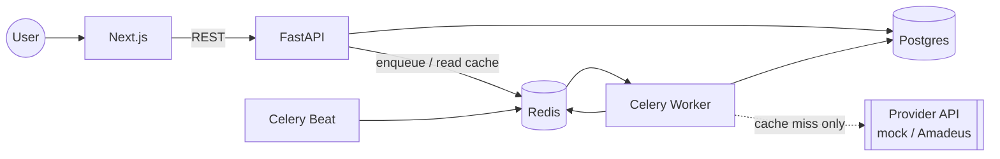

# ✈️ FlightsScanner

**Open-source flexible flight-price tracking.** Describe a trip the way you actually think
about it — *"a ~7-day vacation in early June, non-stop, departing around the 5th"* — and
FlightsScanner continuously finds the cheapest matching itinerary across the whole space of
possible dates, while staying within free-tier flight-API quotas.

> Status: early scaffold (v1). License: **GPL-2.0**.

---

## Why

Flight search assumes you know your exact dates. Flexible travelers don't — and the
cheapest trip is hidden in the combination of *(departure date × trip length)*.
FlightsScanner models trips as **strict + fuzzy constraints**, expands them into concrete
date pairs, and uses an **aggressive cache-first** pipeline so it can monitor many
itineraries without exhausting paid API quotas.

Read the full design in **[docs/design.md](docs/design.md)**.

## Tech stack

| Layer | Tech |
| --- | --- |
| Frontend | Next.js (App Router) · TypeScript · Tailwind · NextAuth |
| Backend API | FastAPI (async) · Pydantic |
| Background jobs | Celery · Redis broker · Celery Beat |
| Data | PostgreSQL · SQLModel · Alembic |
| Cache | Redis (price + dedupe + quota) |
| Infra | Docker Compose · GitHub Actions CI |

## Architecture at a glance



The **worker is the only process that ever calls a provider**, and only on a cache miss.
See [docs/architecture.md](docs/architecture.md).

## Repository layout

```
FlightsScanner/
├── docs/                       # Design documentation (start at design.md)
│   ├── design.md               # ⭐ master design doc
│   ├── architecture.md
│   ├── database-schema.md
│   ├── fuzzy-dates.md
│   ├── caching-strategy.md
│   ├── api-spec.md
│   ├── auth-and-security.md
│   └── development.md
├── backend/                    # FastAPI + Celery (Python)
│   ├── app/
│   │   ├── main.py             # FastAPI app factory
│   │   ├── core/               # config, database engines, security
│   │   ├── models/             # SQLModel tables: User, FlightAlert, FlightResult
│   │   ├── schemas/            # Pydantic request/response DTOs
│   │   ├── api/                # routers + dependencies
│   │   ├── services/           # provider abstraction, alert service, cache
│   │   ├── utils/              # generate_date_pairs (pure, tested)
│   │   └── workers/            # Celery app + cache-first refresh tasks
│   ├── alembic/                # migrations
│   ├── tests/                  # pytest (date logic, cache decisions)
│   ├── Dockerfile
│   ├── requirements.txt
│   └── requirements-dev.txt
├── frontend/                   # Next.js (TypeScript)
│   ├── src/
│   │   ├── app/                # App Router pages + NextAuth route
│   │   ├── components/         # UI (alert form, results)
│   │   ├── lib/                # API client, auth config
│   │   └── types/              # shared TS types
│   ├── Dockerfile
│   └── package.json
├── .github/workflows/ci.yml    # lint + test
├── docker-compose.yml          # full local stack
├── .env.example
└── README.md
```

## Quick start

```bash
git clone <your-fork-url> FlightsScanner
cd FlightsScanner
cp .env.example .env            # local defaults work out of the box
docker compose up --build
```

| Service | URL |
| --- | --- |
| Frontend | http://localhost:3000 |
| Backend API + Swagger | http://localhost:8000/docs |

The default `FLIGHT_PROVIDER=mock` means **no external API keys are required** to run the
whole system end-to-end. More in [docs/development.md](docs/development.md).

## Core concepts

- **FlightAlert** — a flexible config: `origin`, `destination`, `target_duration_days`,
  `duration_flexibility_days`, `earliest_departure_date`, `latest_departure_date`,
  `latest_return_date`, `is_nonstop_required`. See
  [docs/database-schema.md](docs/database-schema.md).
- **Fuzzy → concrete** — `generate_date_pairs(alert)` expands the fuzzy constraints into
  every valid `(departure, return)` pair. See [docs/fuzzy-dates.md](docs/fuzzy-dates.md).
- **Cache-first** — each pair is checked in Redis (4h TTL, global dedupe, daily quota
  guard) before any provider call. See [docs/caching-strategy.md](docs/caching-strategy.md).

## API

- `POST /api/alerts` — create a tracking config (seeds an initial background refresh).
- `GET /api/alerts/{user_id}` — list the user's alerts.
- `GET /api/alerts/{user_id}/results` — lowest cached prices for the user's alerts.
- `PATCH /api/alerts/{alert_id}` — edit constraints / pause / resume.
- `DELETE /api/alerts/{alert_id}` — stop tracking.
- `POST /api/alerts/{alert_id}/refresh` — force a refresh now (quota-guarded).

Full contract: [docs/api-spec.md](docs/api-spec.md). Live schema at `/docs` when running.

Two flight providers are included behind one interface: a deterministic **mock** (default,
no keys) and a real **Amadeus** adapter (`FLIGHT_PROVIDER=amadeus` + `AMADEUS_*` keys).

## Development & testing

```bash
# backend
cd backend && pip install -r requirements.txt -r requirements-dev.txt
pytest && ruff check .

# frontend
cd frontend && npm install
npm run lint && npm run typecheck
```

CI mirrors these checks: [.github/workflows/ci.yml](.github/workflows/ci.yml).

## Contributing

This is GPL-2.0 open source. Issues and PRs welcome. Please keep
`backend/app/utils/date_logic.py` pure (no I/O) and run lint + tests before pushing. See
[docs/development.md](docs/development.md) for conventions.

## License

[GPL-2.0](LICENSE).
