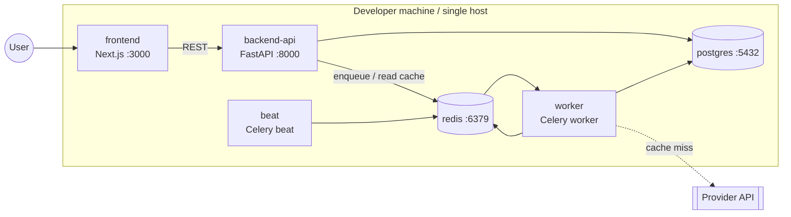
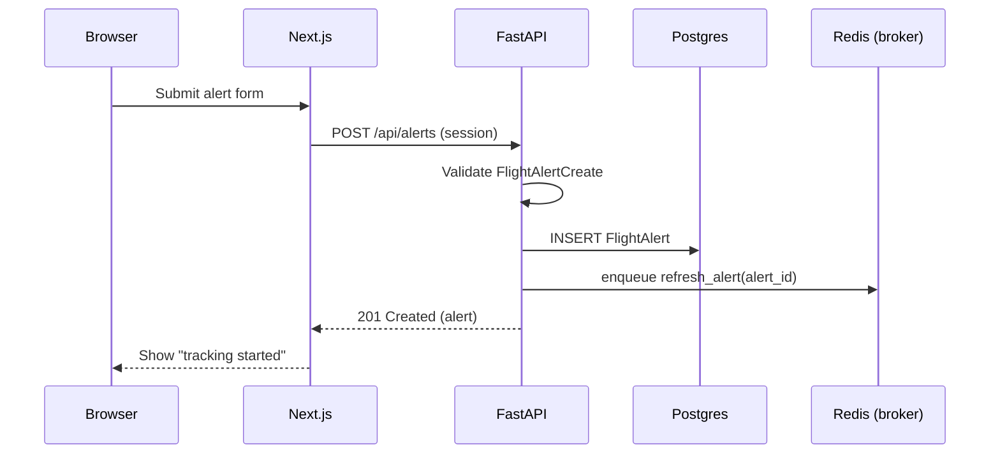
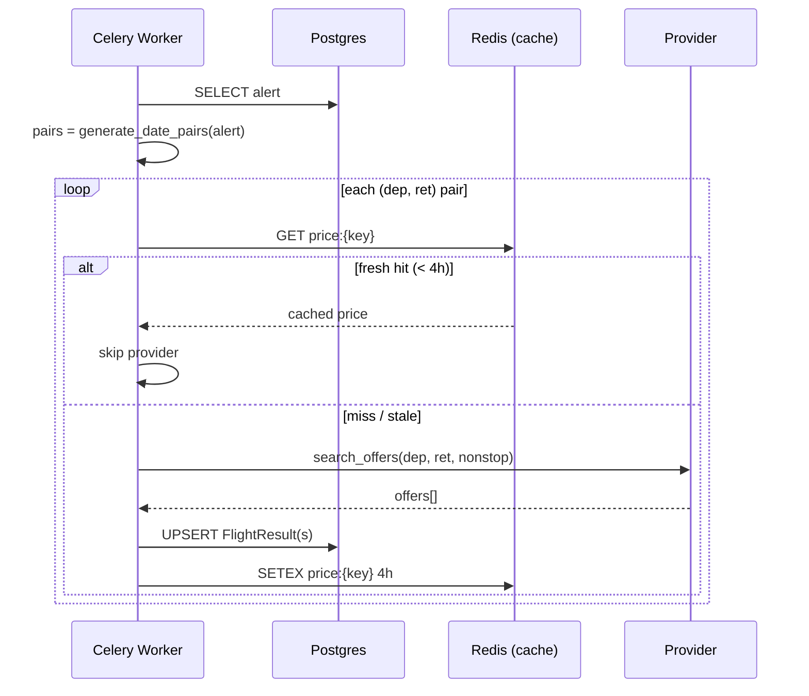
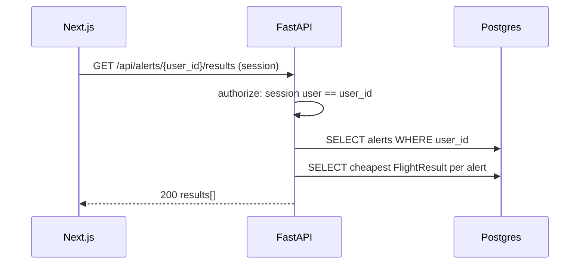

# Architecture

Detailed component, module, and deployment view for FlightsScanner. For the high-level
summary and rationale, start with [design.md](./design.md).

## 1. Deployment topology (local / Docker Compose)



All six services are defined in [`docker-compose.yml`](../docker-compose.yml). `worker` and
`beat` run the **same backend image** with different commands, so business logic is shared
and built once.

## 2. Process model

| Service | Image | Command (essence) | Scales by |
| --- | --- | --- | --- |
| `frontend` | `frontend/Dockerfile` | `next dev` / `next start` | replicas behind a proxy |
| `backend-api` | `backend/Dockerfile` | `uvicorn app.main:app` | replicas (stateless) |
| `worker` | `backend/Dockerfile` | `celery -A app.workers.celery_app worker` | replicas / concurrency |
| `beat` | `backend/Dockerfile` | `celery -A app.workers.celery_app beat` | **singleton** (exactly one) |
| `postgres` | `postgres:16` | — | vertical / managed |
| `redis` | `redis:7` | — | vertical / managed |

> **Beat must be a singleton.** Two beat schedulers would double-enqueue periodic jobs.
> The API and worker are horizontally scalable because they hold no local state.

## 3. Backend module layout

```
backend/app/
├── main.py                 # FastAPI app factory, router registration, lifespan
├── core/
│   ├── config.py           # Pydantic Settings (env-driven)
│   ├── database.py         # async + sync engines, session factories
│   └── security.py         # password hashing, token helpers
├── models/                 # SQLModel tables (durable schema)
│   ├── user.py
│   ├── flight_alert.py
│   └── flight_result.py
├── schemas/                # Pydantic request/response DTOs
│   ├── alert.py
│   └── result.py
├── api/
│   ├── deps.py             # shared dependencies (db session, current user)
│   └── routes/
│       ├── health.py
│       └── alerts.py       # POST /alerts, GET /alerts/{user_id}/results
├── services/
│   ├── provider/
│   │   ├── base.py         # FlightProvider protocol + DTOs
│   │   └── mock.py         # deterministic mock provider (v1 default)
│   ├── alert_service.py    # create alert, query lowest results
│   └── cache.py            # Redis cache key builder + get/set helpers
├── utils/
│   └── date_logic.py       # generate_date_pairs (pure, tested)
└── workers/
    ├── celery_app.py       # Celery instance + beat schedule
    └── tasks.py            # refresh_alert / refresh_all_active_alerts
```

### Layering rules

- `api/` depends on `services/` and `schemas/`, never on `workers/`.
- `services/` depends on `models/`, `utils/`, and `core/`.
- `utils/` is **pure** — no imports from `models`, `services`, or any I/O.
- `workers/` depends on `services/` and `utils/` (reuses the same business logic the API
  uses, so a price refresh behaves identically whether triggered by Beat or by alert
  creation).

## 4. Key sequence diagrams

### 4.1 Create alert → seed first refresh



### 4.2 Worker refresh with cache-first dedupe



### 4.3 Read lowest results (no provider call)



## 5. Data store responsibilities

| Store | Holds | Lifetime |
| --- | --- | --- |
| **Postgres** | Users, alerts, all `FlightResult` rows (durable history) | Permanent until deleted |
| **Redis (cache namespace `price:*`, `quota:*`)** | Hot lowest-price per date pair, dedupe markers, provider quota counters | TTL-bound (4h price, 24h quota) |
| **Redis (broker namespace)** | Celery task messages + results | Until consumed / result expiry |

If Redis is flushed, correctness is preserved: the worker simply treats everything as a
cache miss and refetches (subject to quota), while durable results remain in Postgres.

## 6. Failure modes & resilience

| Failure | Behavior |
| --- | --- |
| Provider timeout / 5xx | Task retries with exponential backoff (Celery `autoretry_for`); date pair left stale, not corrupted. |
| Provider quota exhausted | Quota guard short-circuits the call; task logs and defers; cached/durable data still served. |
| Redis down | API serves durable results from Postgres; refresh enqueues fail fast and are retried by Beat. |
| Postgres down | API returns 503 on write paths; worker retries. |
| Duplicate periodic enqueue | Idempotent cache keys + UPSERT make re-runs harmless. |

## 7. Scaling notes (future)

- Split Redis into **broker** and **cache** instances to isolate eviction policies.
- Run multiple `worker` replicas; partition alerts by hash to spread load.
- Add a read replica for Postgres for the results-read path.
- Introduce a per-provider rate limiter (token bucket in Redis) shared across workers.

See the roadmap in [design.md](./design.md#11-roadmap).
