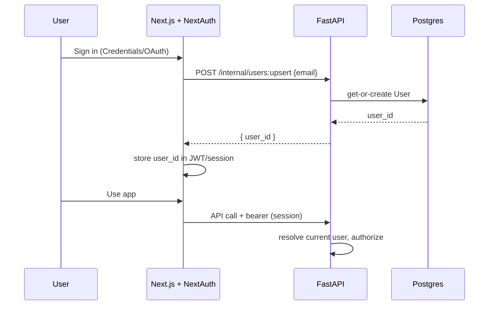

# Authentication & security

How identity, authorization, and hardening work in FlightsScanner. See
[design.md](./design.md) and [api-spec.md](./api-spec.md) for surrounding context.

## 1. Identity model

- **NextAuth.js (Auth.js)** on the frontend owns the user-facing session (sign-in,
  cookies, CSRF, JWT/session rotation).
- The **backend `users` table** is the system of record for application identity that
  alerts hang off of (see [database-schema.md](./database-schema.md)).
- These are reconciled by **email**: when a user signs in via NextAuth, the frontend calls
  the backend to *upsert* a `User` (get-or-create by email) and caches the backend
  `user_id` in the session token.

> v1 ships the **Credentials provider** wired to the backend for a zero-dependency local
> setup. OAuth providers (Google, GitHub) drop into the same NextAuth config without
> backend changes.

## 2. Authorization rules

- Every alert and result is scoped to a `user_id`.
- `GET /api/alerts/{user_id}/results` requires the **authenticated user to equal
  `user_id`**, else `403`. The backend never trusts the path param alone.
- Mutations (create alert) always bind the new row to the authenticated user, ignoring any
  `user_id` supplied in the body.
- Service-layer queries always filter by owner; there are no "list all" endpoints exposed
  to clients.

## 3. Secrets & configuration

- All secrets come from environment variables (12-factor). Nothing secret is committed;
  [`.env.example`](../.env.example) documents the variables with safe placeholders.
- Critical secrets: `NEXTAUTH_SECRET`, `SECRET_KEY` (backend token signing), database and
  Redis credentials, and provider API keys (`AMADEUS_CLIENT_ID/SECRET`).
- In production, inject secrets via the platform's secret manager, not `.env` files.

## 4. OWASP Top 10 alignment

| Risk | Mitigation in this design |
| --- | --- |
| **A01 Broken access control** | Server-side ownership checks on every resource; path `user_id` must match session; no mass-assignment of `user_id`. |
| **A02 Cryptographic failures** | Passwords hashed with bcrypt/argon2 (`core/security.py`); TLS terminated at the proxy in prod; secrets never logged. |
| **A03 Injection** | SQLModel/SQLAlchemy parameterized queries only — no string-built SQL; Pydantic validates/coerces all input; IATA codes constrained by regex. |
| **A04 Insecure design** | Provider isolation, quota guard, and dedupe prevent abuse/cost blowups; least-privilege DB user. |
| **A05 Security misconfiguration** | CORS allow-list (not `*`) via `BACKEND_CORS_ORIGINS`; debug off in prod; non-root container users. |
| **A06 Vulnerable components** | Pinned dependencies; CI runs on every push; Dependabot recommended. |
| **A07 Auth failures** | NextAuth handles session/CSRF/rotation; rate-limit auth endpoints (proxy/middleware); generic auth errors. |
| **A08 Integrity failures** | Lockfiles committed (`package-lock.json`, pinned `requirements.txt`); CI verifies build. |
| **A09 Logging/monitoring** | Structured logs in API and worker; health endpoints; no secrets/PII in logs. |
| **A10 SSRF** | Only known provider base URLs are called, from the worker only; URLs are never taken from user input. |

## 5. Input validation specifics

- IATA codes: `^[A-Z]{3}$`.
- Date ordering and feasibility validated in the Pydantic schema **before** persistence
  (see [api-spec.md](./api-spec.md)); infeasible windows are rejected with `400`.
- Numeric bounds: durations and flexibility are non-negative integers with sane upper
  caps to prevent combinatorial blowups (defense-in-depth with the date-pair guardrails in
  [fuzzy-dates.md](./fuzzy-dates.md)).

## 6. Network & container posture

- Containers run as **non-root** where possible; only required ports are exposed.
- In local Compose, Postgres/Redis are reachable only on the Compose network (no host
  publish needed in prod).
- Backend CORS is restricted to the frontend origin(s).

## 7. Prompt-injection / third-party data

Provider responses are **data, not instructions**. They are parsed into typed DTOs; no
field from a provider is ever evaluated, executed, or used to build a URL to call. Deep
links are stored and rendered as plain, non-executable links.
