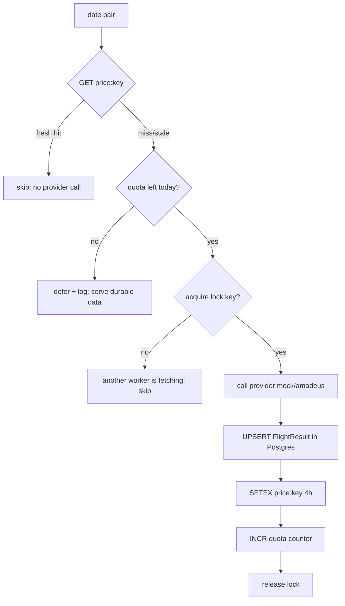

# Caching & quota strategy

How FlightsScanner stays cheap on top of quota-limited flight providers. See
[design.md](./design.md) for goals and [architecture.md](./architecture.md) for where
Redis sits. Implemented in [`backend/app/services/cache.py`](../backend/app/services/cache.py)
and [`backend/app/workers/tasks.py`](../backend/app/workers/tasks.py).

## 1. Principles

1. **The provider is the expensive resource.** Treat every call as costly and rationed.
2. **Cache-first, always.** Never call a provider when a fresh-enough answer exists.
3. **Deduplicate globally.** Identical queries from *different* alerts share one cache
   entry — the cache key is derived from query semantics, not from the alert id.
4. **Durable + hot.** Postgres keeps results forever; Redis keeps the hot lowest price with
   a short TTL. Losing Redis never loses data, only freshness.

## 2. Cache keys

All cache keys are canonical and lowercased so equivalent queries collide intentionally.

| Namespace | Key pattern | Value | TTL |
| --- | --- | --- | --- |
| Price/dedupe | `price:{origin}:{dest}:{dep}:{ret}:{nonstop}:{cabin}` | JSON: lowest price, currency, carrier, deep link, `fetched_at` | **4h** (`CACHE_TTL_SECONDS`) |
| Quota counter | `quota:{provider}:{YYYYMMDD}` | integer call count | until next UTC day (~24h) |
| In-flight lock | `lock:{price-key}` | `1` | short (e.g. 60s) |

Example: `price:jfk:lhr:2026-06-01:2026-06-08:1:economy`.

- `nonstop` is `1`/`0`. A non-stop query and an any-stops query are **different** keys
  (different result sets), which is correct.
- The key intentionally **excludes `alert_id` and `user_id`** — that is what enables
  cross-alert dedupe.

## 3. The cache-first refresh task

`refresh_alert(alert_id)` (Celery) does, per date pair from
[`generate_date_pairs`](./fuzzy-dates.md):

- **Freshness check.** A hit younger than the TTL short-circuits — the dominant path once
  warm.
- **Quota guard.** Before any miss-driven call, `INCR quota:{provider}:{day}` is checked
  against `PROVIDER_DAILY_QUOTA`. Over budget → skip and log; durable data still serves.
- **In-flight lock.** A short `SET NX` lock prevents a thundering herd of workers fetching
  the same key simultaneously (e.g., two alerts sharing a pair refreshed at once).
- **Idempotency.** UPSERT on `(alert_id, dep, ret, provider)` + deterministic keys make
  re-runs harmless.

## 4. TTL rationale (why 4 hours)

- Flight prices move on the order of hours, not seconds. 4h balances freshness against
  quota burn.
- Configurable via `CACHE_TTL_SECONDS`. Lower for demos, raise to stretch tight quotas.
- TTL applies to the **price cache only**; durable `FlightResult` rows persist regardless
  and simply get overwritten on the next successful fetch.

## 5. Invalidation

- **Time-based** primarily (TTL expiry).
- **Event-based** hooks (future): editing an alert's strict constraints can proactively
  delete affected `price:*` keys; pausing an alert simply stops refreshes.
- A manual "refresh now" action can bypass the freshness check (but **not** the quota
  guard) by deleting the relevant keys before enqueueing.

## 6. Quota accounting

- Counter per provider per UTC day: `quota:{provider}:{YYYYMMDD}`, `INCR` on each real call,
  TTL to next midnight.
- `PROVIDER_DAILY_QUOTA` (env) caps daily calls below the provider's free-tier ceiling.
- When exhausted, the system degrades gracefully: reads keep working from cache/Postgres;
  only *new* fetches pause until the counter resets.

## 7. Sync vs async

The cache helpers and the Celery task run **synchronously** (`redis-py` sync client,
`psycopg2` session) because Celery prefork workers are sync. The FastAPI read path uses the
**async** client/session. Both talk to the same Redis and Postgres. This split is a
deliberate, documented decision (see [design.md](./design.md#a-note-on-async-fastapi-vs-sync-celery)).

## 8. What is *not* cached

- User/alert records (cheap relational reads from Postgres).
- Authn/session state (owned by NextAuth on the frontend).
- Provider error responses (we retry with backoff rather than cache failures), except a
  short negative-cache could be added later to avoid hammering a hard-failing route.
