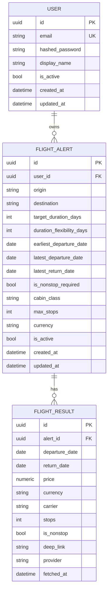

# Database schema

Data model for FlightsScanner. See [design.md](./design.md) for context and
[architecture.md](./architecture.md) for where the database sits in the system.

## 1. ORM choice: SQLModel

We use **[SQLModel](https://sqlmodel.tiangolo.com/)** (SQLAlchemy 2.0 core + Pydantic v2)
so each table is defined once and reused for validation. Tradeoffs:

- ➕ One source of truth; ergonomic with FastAPI; less boilerplate than parallel
  SQLAlchemy + Pydantic class hierarchies.
- ➖ Relationship/lazy-load semantics under async require care — we always **eager-load**
  with `selectinload` on the async path and use a **sync** session inside Celery.
- ➖ Alembic autogenerate occasionally needs manual review for SQLModel types.

DTOs that are *not* tables (request/response bodies) live in `app/schemas/` as plain
Pydantic models to keep API contracts decoupled from storage.

## 2. Entity-relationship overview



## 3. Tables

### 3.1 `users`

| Column | Type | Constraints | Notes |
| --- | --- | --- | --- |
| `id` | UUID | PK, default uuid4 | Stable internal identity. |
| `email` | varchar(320) | unique, not null, indexed | Login identity; mirrors NextAuth user. |
| `hashed_password` | varchar | nullable | Null for OAuth-only accounts. |
| `display_name` | varchar(120) | nullable | |
| `is_active` | boolean | not null, default true | Soft disable. |
| `created_at` | timestamptz | not null, default now | |
| `updated_at` | timestamptz | not null, auto-update | |

See [auth-and-security.md](./auth-and-security.md) for how this row relates to the
NextAuth session.

### 3.2 `flight_alerts`

The core flexible-itinerary configuration. Splits **strict** vs **fuzzy** constraints.

| Column | Type | Constraints | Notes |
| --- | --- | --- | --- |
| `id` | UUID | PK | |
| `user_id` | UUID | FK → users.id, not null, indexed, ON DELETE CASCADE | Owner. |
| `origin` | varchar(3) | not null | IATA code, e.g. `JFK`. **Strict.** |
| `destination` | varchar(3) | not null | IATA code, e.g. `LHR`. **Strict.** |
| `target_duration_days` | int | not null, > 0 | Ideal trip length. **Fuzzy anchor.** |
| `duration_flexibility_days` | int | not null, ≥ 0, default 0 | ± days around target. **Fuzzy.** |
| `earliest_departure_date` | date | not null | Start of departure window. **Fuzzy.** |
| `latest_departure_date` | date | nullable | End of departure window (D5). If null, derived. **Fuzzy.** |
| `latest_return_date` | date | not null | Hard outer bound for the return leg. **Strict cap.** |
| `is_nonstop_required` | boolean | not null, default false | **Strict.** |
| `max_stops` | int | nullable | Optional cap when non-stop not required. **Strict.** |
| `cabin_class` | varchar(16) | not null, default `economy` | economy/premium/business/first. |
| `currency` | varchar(3) | not null, default `USD` | ISO-4217 for pricing. |
| `is_active` | boolean | not null, default true | Pauses refresh without deleting. |
| `created_at` | timestamptz | not null | |
| `updated_at` | timestamptz | not null | |

**Validation (enforced in the Pydantic schema, see [api-spec.md](./api-spec.md)):**

- `earliest_departure_date` ≤ `latest_departure_date` (when provided) ≤ `latest_return_date`.
- `duration_flexibility_days` < `target_duration_days` (so min duration ≥ 1).
- IATA codes are 3 uppercase letters.

> **Design note (D5):** `latest_departure_date` is an explicit, optional bound on the
> *departure* window, matching phrasing like "depart between Jun 1 and Jun 10." When
> omitted, the date-pair generator derives the latest sensible departure from
> `latest_return_date − min_duration`. See [fuzzy-dates.md](./fuzzy-dates.md).

### 3.3 `flight_results`

A cached, priced itinerary for one concrete date pair of an alert.

| Column | Type | Constraints | Notes |
| --- | --- | --- | --- |
| `id` | UUID | PK | |
| `alert_id` | UUID | FK → flight_alerts.id, not null, indexed, ON DELETE CASCADE | |
| `departure_date` | date | not null | |
| `return_date` | date | not null | |
| `price` | numeric(10,2) | not null | Total round-trip price. |
| `currency` | varchar(3) | not null | |
| `carrier` | varchar(64) | nullable | Marketing carrier / airline. |
| `stops` | int | not null, default 0 | Max stops across legs. |
| `is_nonstop` | boolean | not null | Convenience flag (`stops == 0`). |
| `deep_link` | text | nullable | Provider/airline booking URL. |
| `provider` | varchar(32) | not null | Source key, e.g. `mock`, `amadeus`. |
| `fetched_at` | timestamptz | not null, indexed | Freshness timestamp. |

**Uniqueness / upsert key:**
`(alert_id, departure_date, return_date, provider)` is **unique**. The worker UPSERTs on
this key so a refresh overwrites the previous price for that pair rather than duplicating.

## 4. Indexes

| Index | Columns | Purpose |
| --- | --- | --- |
| `ix_users_email` | `users(email)` | Login lookup / uniqueness. |
| `ix_flight_alerts_user_id` | `flight_alerts(user_id)` | List a user's alerts. |
| `ix_flight_alerts_active` | `flight_alerts(is_active)` | Beat scans active alerts. |
| `uq_flight_results_pair` | `flight_results(alert_id, departure_date, return_date, provider)` | UPSERT target; dedupe. |
| `ix_flight_results_alert_price` | `flight_results(alert_id, price)` | "Cheapest per alert" query. |
| `ix_flight_results_fetched_at` | `flight_results(fetched_at)` | Staleness sweeps / cleanup. |

## 5. Lifecycle & retention

- Deleting a user cascades to alerts and results.
- Deleting/pausing an alert: pausing sets `is_active = false` (refresh skipped); deleting
  cascades results.
- A future cleanup task prunes `flight_results` older than N days (keeps a rolling window
  for price-history charts). Tracked in the roadmap.

## 6. Schema bootstrap & migrations

**v1 dev bootstrap (create_all).** To make `docker compose up` work with zero manual steps,
the backend container runs [`app/prestart.py`](../backend/app/prestart.py) before Uvicorn:
it waits for Postgres and calls `SQLModel.metadata.create_all`. This is idempotent and
creates the tables, indexes, and constraints above.

**Schema evolution (Alembic).** For real schema changes — and for production, where you
should disable the create-all bootstrap and manage the schema exclusively through
migrations — use Alembic:

- Alembic runs against the **sync** (`psycopg2`) URL — see
  [caching-strategy.md](./caching-strategy.md#7-sync-vs-async) and `core/database.py`. The
  DSN is injected in [`alembic/env.py`](../backend/alembic/env.py).
- Generate the first migration once a DB is up:
  ```bash
  alembic revision --autogenerate -m "initial schema"
  alembic upgrade head
  ```
- Review autogenerated diffs for SQLModel column types before committing.

> ⚠️ Don't mix both paths against the same database: if `create_all` already built the
> schema, switch fully to Alembic (baseline with `alembic stamp head`) before applying
> migrations.

