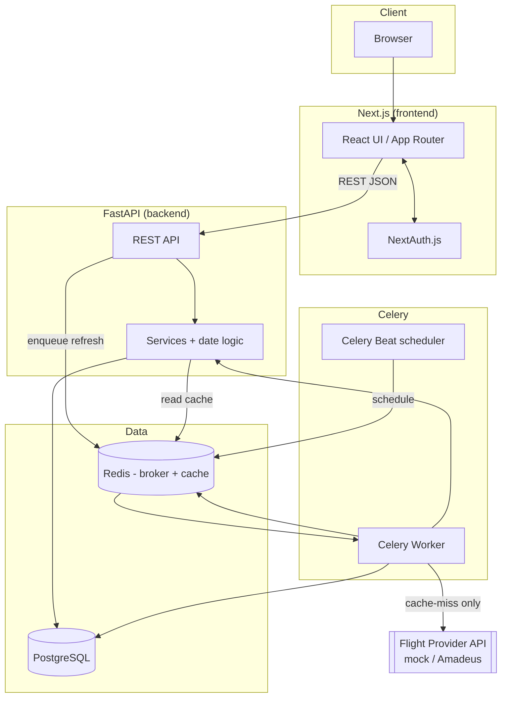

# FlightsScanner — System Design Document

> Master design document for **FlightsScanner**, an open-source flexible flight-price tracking application.
>
> Status: **Draft v1** · Last updated: 2026-06-25 · License: GPL-2.0

This document is the entry point for the project's design. It captures the problem,
the goals, the high-level architecture, and the major design decisions. It links out
to focused sub-documents for the parts that warrant deeper treatment.

## Table of contents

1. [Problem statement](#1-problem-statement)
2. [Goals and non-goals](#2-goals-and-non-goals)
3. [Core domain concepts](#3-core-domain-concepts)
4. [High-level architecture](#4-high-level-architecture)
5. [Tech stack and rationale](#5-tech-stack-and-rationale)
6. [Component responsibilities](#6-component-responsibilities)
7. [Request & data flows](#7-request--data-flows)
8. [Cross-cutting concerns](#8-cross-cutting-concerns)
9. [Linked design documents](#9-linked-design-documents)
10. [Design decision log](#10-design-decision-log)
11. [Roadmap](#11-roadmap)

---

## 1. Problem statement

Flight search engines are optimized for travelers who already know their exact dates.
But a large class of trips are **flexible**:

- *"I want a ~7 day vacation sometime in early June."*
- *"Departure around the 5th, give or take a couple of days."*
- *"Non-stop only, and I can stretch the trip by a day if it's cheaper."*

For these travelers, the cheapest itinerary is hidden in the **combinatorial space** of
(departure date × trip length) pairs. Checking every combination by hand is tedious, and
doing it repeatedly to catch price drops is impractical.

FlightsScanner lets a user describe a trip as a set of **strict and fuzzy constraints**,
then continuously and cheaply monitors the matching itinerary space for the lowest price,
notifying nobody by default but always surfacing the current best option on demand.

The central engineering challenge is **cost**: consumer flight-price APIs (Amadeus
Self-Service, Kiwi/Tequila, Skyscanner partner APIs, etc.) have tight free-tier quotas.
A single flexible alert can expand into dozens of date pairs, and we may track thousands
of alerts. The system must therefore be **aggressively cache-first** and **quota-aware**.

## 2. Goals and non-goals

### Goals

- **G1 — Flexible itineraries.** Model trips as fuzzy constraints (duration ± flex,
  departure window, non-stop requirement) rather than fixed dates.
- **G2 — Cost-efficient data fetching.** Never call a paid/quota'd provider when a
  sufficiently fresh cached answer exists. Deduplicate identical queries across alerts.
- **G3 — Background freshness.** Keep cached prices reasonably fresh via scheduled
  background refresh, decoupled from the user request path.
- **G4 — Self-hostable.** A single `docker compose up` brings up the entire stack
  locally with no external accounts required (providers are mockable).
- **G5 — Clean contracts.** A typed REST API between the Next.js frontend and the
  FastAPI backend, with typed models on both ends.

### Non-goals (for v1)

- **NG1 — Actual booking.** We surface deep links to book on the provider/airline; we do
  not process payments or issue tickets.
- **NG2 — Multi-provider aggregation.** v1 ships with a single pluggable provider
  interface and a mock implementation. Real providers are adapters added later.
- **NG3 — Notifications.** No email/push in v1. The architecture leaves a seam for it
  (a Celery task + a `Notification` model) but it is out of scope.
- **NG4 — Multi-city / open-jaw trips.** v1 handles round-trips (origin → destination →
  origin). The schema is extensible toward multi-leg later.
- **NG5 — Horizontal scale tuning.** We design for correctness and modest scale
  (single Postgres, single Redis). Sharding/replication is future work.

## 3. Core domain concepts

| Concept | Meaning |
| --- | --- |
| **User** | An authenticated account that owns alerts. |
| **FlightAlert** | A *flexible* tracking configuration. Holds the strict constraints (origin, destination, non-stop) and the fuzzy constraints (target duration, duration flexibility, departure window). |
| **Date pair** | A concrete `(departure_date, return_date)` tuple derived from an alert's fuzzy constraints. The unit of work for a provider query. |
| **FlightResult** | A cached priced itinerary for a specific date pair belonging to an alert, including a deep booking link and freshness timestamp. |
| **Provider** | An external source of flight offers (Amadeus, etc.). Hidden behind a single `FlightProvider` interface; v1 ships a deterministic mock. |
| **Quota window** | The Redis-tracked dedupe/TTL window (default 4h) during which an identical provider query is *not* repeated. |

The relationship between fuzzy constraints and concrete work is the heart of the system:

```
FlightAlert (fuzzy)  --generate_date_pairs()-->  [DatePair, DatePair, ...] (concrete)
        |                                                   |
        |                                          per pair: cache-check
        |                                                   |
        +------------------ FlightResult <---- provider query (cache miss only)
```

See **[fuzzy-dates.md](./fuzzy-dates.md)** for the expansion algorithm and
**[caching-strategy.md](./caching-strategy.md)** for the dedupe/TTL model.

## 4. High-level architecture

FlightsScanner is a small **service-oriented monorepo**: a Next.js frontend, a FastAPI
backend, a Celery worker + beat scheduler, with Postgres for durable state and Redis as
both the Celery broker and the price cache.



Key properties:

- **The user request path never blocks on a provider call.** Reads come from Postgres
  (durable results) and Redis (hot cache). Fetching is always asynchronous.
- **Redis plays two roles**: Celery broker/result-backend *and* the price/dedupe cache.
  These use different key namespaces and can be split into two Redis instances later.
- **The provider is only ever touched by the worker**, never by the API process. This
  centralizes quota accounting and keeps the API stateless and fast.

A deeper component and deployment view lives in **[architecture.md](./architecture.md)**.

## 5. Tech stack and rationale

| Layer | Choice | Why |
| --- | --- | --- |
| Frontend | **Next.js (App Router) + TypeScript + Tailwind** | SSR/ISR, file-based routing, first-class TS, fast styling. |
| Auth | **NextAuth.js (Auth.js)** | Batteries-included session/JWT handling; pluggable providers. See [auth-and-security.md](./auth-and-security.md). |
| Backend API | **FastAPI (async)** | Type-driven, async-native, automatic OpenAPI, excellent Pydantic integration. |
| ORM | **SQLModel** (SQLAlchemy 2.0 core + Pydantic) | One model definition shared between persistence and validation; created by FastAPI's author. Tradeoffs noted in [database-schema.md](./database-schema.md). |
| Async driver | **asyncpg** (API) + **psycopg2** (worker/migrations) | API is async; Celery is sync — see note below. |
| Background jobs | **Celery + Redis broker** | Mature task queue, periodic scheduling via Beat, retries/backoff built in. |
| Cache / broker | **Redis** | Single dependency serving both broker and TTL cache. |
| Database | **PostgreSQL** | Robust relational store; JSONB headroom for provider payloads. |
| Migrations | **Alembic** | Standard SQLAlchemy migration tool. |
| Infra (local) | **Docker Compose** | One command to run the whole system. |
| CI | **GitHub Actions** | Lint + test on every push/PR. |

### A note on async (FastAPI) vs sync (Celery)

FastAPI is async and uses an `asyncpg`-backed `AsyncSession`. Celery's execution model is
synchronous (prefork workers), and mixing an event loop into a prefork worker is fragile.
We therefore deliberately maintain **two database access paths**:

- **Async** (`asyncpg`) for the API request path.
- **Sync** (`psycopg2`) for Celery tasks and Alembic migrations.

Both point at the same database. This duplication is intentional and is the most robust
pattern in production today. It is documented in [database-schema.md](./database-schema.md)
and [caching-strategy.md](./caching-strategy.md).

## 6. Component responsibilities

- **`frontend/`** — Next.js app. Renders the alert builder and results dashboard, owns
  the user session via NextAuth, and talks to the backend over typed REST calls.
- **`backend/app/api/`** — FastAPI routers. Thin HTTP layer: validate input, call
  services, shape responses. No business logic.
- **`backend/app/services/`** — Business logic: provider abstraction, result querying,
  alert orchestration. The only place that knows how to talk to a provider.
- **`backend/app/utils/date_logic.py`** — Pure functions, most importantly
  `generate_date_pairs(...)`. No I/O, fully unit-testable.
- **`backend/app/workers/`** — Celery app, periodic schedule, and the cache-first
  refresh task that fans an alert out into date pairs.
- **`backend/app/models/`** — SQLModel table definitions (durable schema).
- **`backend/app/core/`** — Settings, database engines/sessions, security helpers.

## 7. Request & data flows

### 7.1 Creating an alert (`POST /api/alerts`)

1. Frontend submits the alert form; NextAuth attaches the session.
2. FastAPI validates the body against `FlightAlertCreate`.
3. The alert is persisted to Postgres.
4. The API **enqueues an initial refresh task** (fire-and-forget) so results start
   populating without blocking the response.
5. API returns the created alert (`201`).

### 7.2 Background refresh (Celery)

1. Beat periodically enqueues `refresh_all_active_alerts` (or a single alert is enqueued
   on creation).
2. The worker loads the alert and calls `generate_date_pairs(alert)`.
3. For each date pair it builds a canonical cache key and checks Redis.
4. **Cache hit (fresh < 4h):** skip — no provider call.
5. **Cache miss:** call the provider (mock in v1), parse offers, upsert `FlightResult`
   rows in Postgres, and write the price into Redis with a 4h TTL.

### 7.3 Reading results (`GET /api/alerts/{user_id}/results`)

1. Frontend requests results for the signed-in user.
2. FastAPI authorizes ownership, loads the user's alerts, and returns the **lowest-priced**
   `FlightResult` per alert (plus optionally the top-N cheapest pairs).
3. No provider calls occur on this path — strictly cache/DB reads.

Full request/response shapes are in **[api-spec.md](./api-spec.md)**.

## 8. Cross-cutting concerns

- **Caching & quota:** dedupe identical queries, 4h TTL, per-provider daily quota guard.
  See [caching-strategy.md](./caching-strategy.md).
- **Auth & security:** NextAuth session ↔ backend identity, ownership checks, input
  validation, secrets handling. See [auth-and-security.md](./auth-and-security.md).
- **Configuration:** all config via environment variables (12-factor). See
  [`.env.example`](../.env.example) and [development.md](./development.md).
- **Observability:** structured logs from API and worker; health endpoints; Celery task
  state in Redis. Metrics/tracing are roadmap items.
- **Testing:** pure date logic and caching decisions are unit-tested; CI runs lint + tests.

## 9. Linked design documents

| Document | Covers |
| --- | --- |
| [architecture.md](./architecture.md) | Detailed component, deployment, and module layout; sequence diagrams. |
| [database-schema.md](./database-schema.md) | Tables, columns, indexes, relationships, ORM choice, migrations. |
| [fuzzy-dates.md](./fuzzy-dates.md) | The `generate_date_pairs` algorithm, edge cases, complexity. |
| [caching-strategy.md](./caching-strategy.md) | Cache keys, TTLs, dedupe, quota guard, invalidation. |
| [api-spec.md](./api-spec.md) | REST endpoints, payloads, status codes, error model. |
| [auth-and-security.md](./auth-and-security.md) | Auth flow, authorization, OWASP-aligned hardening. |
| [development.md](./development.md) | Local setup, common commands, project layout, conventions. |

## 10. Design decision log

| # | Decision | Alternatives considered | Rationale |
| --- | --- | --- | --- |
| D1 | Cache-first worker is the **only** caller of providers | API calls provider on demand | Centralizes quota accounting; keeps API fast and stateless. |
| D2 | **Redis** serves both broker and price cache | Separate cache (Memcached) | One fewer dependency for self-hosters; namespaced keys; splittable later. |
| D3 | **SQLModel** for models | Plain SQLAlchemy 2.0 + separate Pydantic | Less boilerplate, single source of truth; acceptable async caveats. |
| D4 | **Dual DB drivers** (async API, sync worker) | Force async in Celery | Most robust; avoids event-loop-in-prefork fragility. |
| D5 | Added explicit optional **`latest_departure_date`** to the alert | Derive solely from `latest_return_date` | Matches real phrasing ("depart between Jun 1–10"); bounds the search space. |
| D6 | **Round-trip only** in v1 | Multi-city from day one | Smaller surface; schema kept extensible. |
| D7 | Provider behind a **single interface + mock** | Integrate Amadeus immediately | Lets the whole system run with zero external accounts; real adapters drop in later. |
| D8 | Store **durable results in Postgres** *and* hot price in Redis | Redis-only | Results survive cache eviction/restart and power historical views later. |

## 11. Roadmap

1. **v1 (this scaffold):** flexible alerts with full CRUD + manual refresh, mock **and**
   Amadeus providers, cache-first refresh, results API, auth, local Docker stack, CI.
2. **v1.1:** Amadeus quota-guard hardening and live-call integration tests; price history.
3. **v1.2:** notifications (email) on price-drop thresholds via a `Notification` model.
4. **v1.3:** multi-provider aggregation and best-of comparison.
5. **v2:** multi-city / open-jaw itineraries; horizontal scaling guidance.
